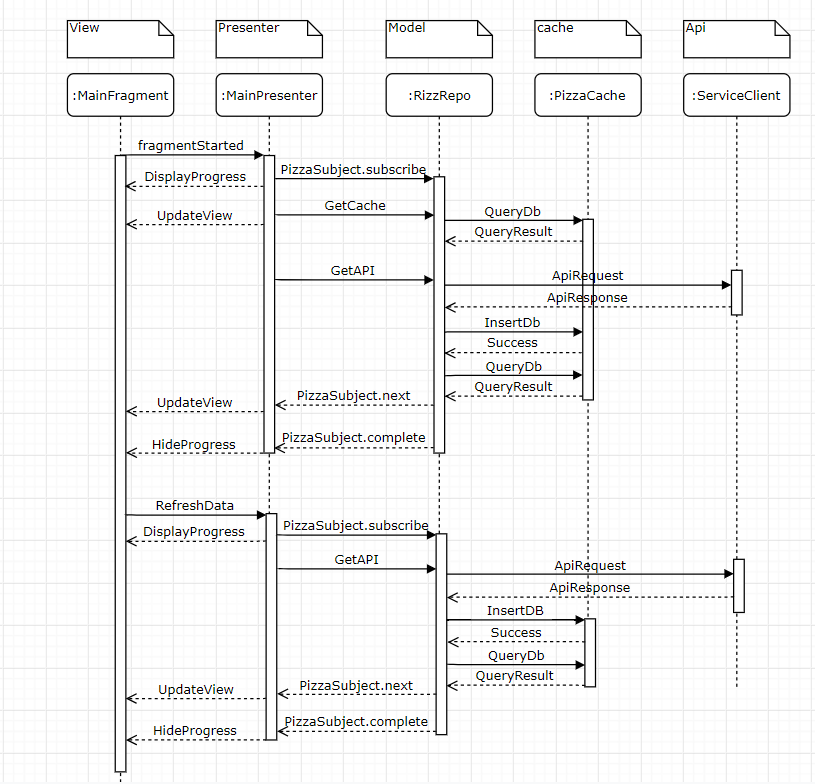

# Pizza app

## The architecture

### How does data flow

## Notes

- I am not using the Controller or Controller listener because I rely on the Repository to manage
    complex data access.
- I use SwipeRefreshLayout for double job
    1. pull to refresh the data instead of refresh button
    2. display refreshing when api request in progress instead of Dialog
- There are some leaks in this architecture like the presenter will never survive the configuration
    changes like screen rotation, and you always need to keep checking if the view still alive before
    update it, to avoid nullPointException.
- I have not used dagger for dependency injection, instead I build simple DI manually to provide
    the required dependency, for task purpose.
- I use RX only to manage the communication between the Repo and Presenter.
- In the Repository i am not forward the Api response directly to the presenter ,
    instead i wait the data to be save in db then i query db for new data ,
    this give me single source of trust "in this situation the db" to avoid data redundancy,
    and easy maintain data from different sources .
- I have built a similar sample for movie db. in MVVM using the new architecture component. It
    provide cleaner code and better functionality and state management
    Check the sample here https://github.com/tohami/MovieDB-example

- To access the image picking activity click on the float action button
- The image that captured is stored private in app data and not accessible from the storage or
    other apps
- There are new architecture component called CameraX , It provides a consistent and easy-to-
    use API surface that works across most Android devices, with backward-compatibility

